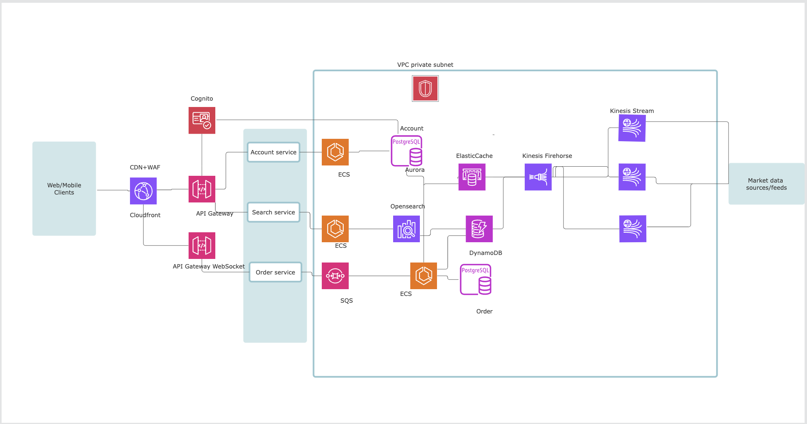

# Problem 2 — Solution

## Functional requirements

### Core requirements

1. Users can see live prices of stocks.
2. Users can manage orders for stocks (market/limit orders; create/cancel orders).
3. Ledger and settlement, keeping position.
4. Platform served 24/7.

### Non-functional requirements

| Area | Target |
|------|--------|
| Availability vs consistency | High availability over strict consistency |
| Throughput | ~500 requests per second |
| Latency | p99 under 100 ms |

### Out of scope

1. Payment gateway — assume Stripe (or similar).
2. Observability (detailed tracing/metrics stack).

---

## Architecture

### Overview diagram

### Cloud services and roles

| Service | Role |
|---------|------|
| **Amazon Kinesis Data Streams** or **Apache Kafka** | Ingest streaming market data (e.g. NYSE, NASDAQ, other venues). |
| **Kinesis Data Firehose**, **EMR**, **Apache Spark** | Clean and process raw streams: normalization and aggregation for best market price. |
| **Amazon DynamoDB** | Store aggregated market data; high write/read throughput; replicas, sharding, multi-AZ. |
| **Amazon ElastiCache (Redis)** | Hot symbols (e.g. liquid names); low-latency reads; Redis cluster for HA. Alternative: Memcached (cache-only). Multi-AZ. |
| **Amazon OpenSearch Service** or **Elasticsearch** | Stock lookup; cache-first, then DynamoDB on miss. |
| **Amazon CloudFront** | CDN + WAF; bot mitigation, rate limiting, throttling. |
| **Amazon API Gateway** | JWT validation, routing (user, order, search). Dedicated **WebSocket API** for real-time tier. |
| **Amazon ECS**, **Fargate**, or **EKS** | Containerized, scalable, event-driven compute. |
| **Amazon Cognito** | Authentication; optional KYC flows; tokens aligned with user store. |
| **Amazon Aurora** or **Amazon RDS** | Users, orders, balances, withdrawal state — ACID and mature relational tooling. |
| **Amazon SQS** or **EventBridge** | Async order pipeline; absorb peaks and reduce lost orders. |
| **Amazon VPC** | Private subnets, controlled egress (e.g. NAT) for security and compliance. |

---

## Scaling plan

1. **Market data:** Increase Kinesis (or Kafka) partitions/shards for higher event volume.
2. **Streaming ETL:** Scale Firehose / EMR / Spark processing capacity.
3. **API / trading path:** Scale ECS tasks or EKS workers for traffic spikes.
4. **Orders and balances:** Shard Aurora/RDS and use read replicas for read-heavy or peak order load.
5. **Search:** Scale OpenSearch/Elasticsearch cluster for query volume.
6. **Market data store:** Scale DynamoDB (on-demand or provisioned), sharding, and read replicas as needed.
